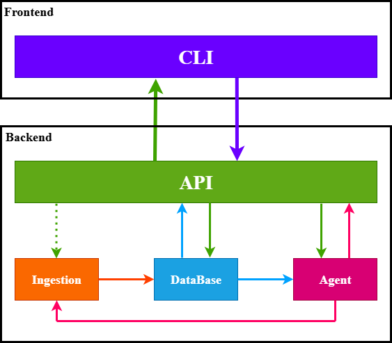

# Document Agent Service

> **DISCLAIMER**: This is an alpha version. Not all features have been completely tested, so there may be issues. If you encounter any problems, please report them by creating an issue in the repository.

## Table of Contents
- [Overview](#overview)
- [Documentation](#documentation)
- [Quick Start](#quick-start)
- [System Architecture](#system-architecture)
- [Key Features](#key-features)
- [Project Structure](#project-structure)
- [Key Technologies](#key-technologies)
- [Deployment and Configuration](#deployment-and-configuration)
- [Service Architecture and Implementation Details](#service-architecture-and-implementation-details)
- [License](#license)

## Overview

The Document Agent Service is a comprehensive solution designed for the intelligent processing of documents through automated ingestion, sophisticated analysis, and conversational querying capabilities. This system bridges the gap between raw document repositories and actionable intelligence by automatically processing various document formats, extracting key information, and making this information available through a natural language interface.

## Documentation

Detailed documentation is available in the `doc/` directory:

- [System Architecture](doc/architecture.md) - Overview of system design and components
- [Features](doc/features.md) - Comprehensive list of system capabilities
- [API Documentation](doc/api.md) - Details of API endpoints and usage
- [Configuration Guide](doc/configuration.md) - Configuration options and settings
- [Deployment Guide](doc/deployment.md) - Instructions for deploying the system
- [Development Guide](doc/development.md) - Guide for developers extending the system
- [Project Structure](doc/project_structure.md) - Overview of codebase organization

## Quick Start

```bash
# Clone the repository
git clone https://github.com/Flomayliz/document_agent_service.git
cd document_agent_service

# Install docker (if required)
chmod +x ./scripts/setup_docker_env.sh
./scripts/setup_docker_env.sh # This will require to logout/login!

# Configure environment variables
cp .env.template .env
# Edit .env with your settings

# Get API keys for LLM providers
# For Gemini API (free): Visit https://ai.google.dev/gemini-api/docs/api-key
# Create a Google AI Studio account and generate an API key

# Start services with Docker
docker compose up -d

# Access APIs
# Agent API: http://localhost:8000/docs
# Admin API: http://localhost:8001/docs
```

## System Architecture

The system architecture follows a modular design with clear separation of concerns. This approach ensures maintainability, extensibility, and scalability. Each component operates independently while communicating through well-defined interfaces.



The architecture consists of four primary modules:

### 1. Ingestion Module

The ingestion module serves as the system's document acquisition and processing pipeline:

- **Document Watcher Service**: 
  - Monitors filesystem events and detects new or modified documents
  - Uses the `watchdog` library for real-time event monitoring
  - Event-driven architecture for efficient resource usage

- **Document Parser System**: 
  - Processes multiple document formats (PDF, DOCX, TXT, etc.)
  - Registry-based architecture for extensibility
  - Specialized libraries for each document type (PyPDF, python-docx, etc.)

- **Information Extraction Pipeline**: 
  - Extracts metadata, keywords, topics, and summaries
  - Performs content analysis for keyword extraction
  - Generates summaries using extractive and abstractive methods

### 2. Database Module

The database module provides persistence for document content and user information:

- **Factory Pattern Implementation**: 
  - Enables swapping different database backends
  - Abstract interfaces for database independence
  - Located in `app/db/factory.py` and `app/db/interfaces.py`

- **Document Repository**: 
  - Stores processed documents with metadata and content
  - Implements efficient search and retrieval capabilities
  - Uses indexing strategies optimized for text search

- **User Management System**: 
  - Handles user accounts and authentication tokens
  - Stores conversation history for context retention
  - Located in `app/db/user_handler.py`

- **MongoDB Implementation**: 
  - Document-oriented storage with flexible schema
  - Schema flexibility for different document types
  - Rich query language for sophisticated document filtering

### 3. Agent Module

The agent module forms the intelligent core of the system, interpreting queries and providing responses:

- **LangChain Agent Framework**: 
  - Tool-based approach to query understanding and resolution
  - Sophisticated prompt system for tool selection
  - Located in `app/agent/agent.py`

- **Flexible LLM Backend**: 
  - Support for OpenAI (GPT models), Google Gemini, and Ollama models
  - Provider-agnostic interface for avoiding vendor lock-in
  - Selection controlled through configuration

- **Specialized Tool Suite**: 
  - Purpose-built tools for document retrieval and analysis
  - Tools for listing documents, retrieving topics, comparing documents
  - Defined in `app/agent/tools.py`

### 4. API Module

The API module exposes the system's capabilities through standardized interfaces:

- **FastAPI Implementation**: 
  - High-performance REST APIs with automatic documentation
  - Asynchronous request handling for superior performance
  - Native support for modern Python features

- **Authentication System**: 
  - Token-based authentication with configurable expiration
  - Middleware for request authorization
  - Token lifecycle management

- **Dual Server Architecture**: 
  - Agent API (port 8000): Document querying interface for end users
  - Admin API (port 8001): Administrative functions with restricted access
  - Separation provides security isolation between user and admin functions

## Key Features

- **Document Processing Capabilities**
  - Comprehensive format support (PDF, DOCX, TXT, CSV, JSON, Markdown)
  - Automated document monitoring with real-time filesystem event detection
  - Document analysis pipeline with metadata extraction and classification
  - Automated document watching for real-time ingestion

- **Agent Intelligence Features**
  - Conversational document interface with natural language query understanding
  - Context-aware conversation with history retention
  - Advanced querying with document comparison and cross-document synthesis
  - Multi-hop reasoning across document contents

- **User Experience**
  - Natural language querying across document corpus
  - Context-aware responses with document citations
  - User history tracking for continuous conversations
  - Token-based authentication with configurable expiration

- **System Integration Features**
  - Comprehensive RESTful API with streaming response support
  - Security features with role-based access control
  - Docker containerization for consistent deployment
  - Configurable LLM providers (OpenAI, Gemini, Ollama)

## Project Structure

The project follows a modular Python package structure organized by component responsibility:

```
document_agent_service/
├── app/                   # Main application package
│   ├── __init__.py
│   ├── agent/             # LLM agent implementation
│   │   ├── __init__.py
│   │   ├── agent.py       # Main agent implementation
│   │   ├── llm_backend.py # LLM provider abstraction
│   │   └── tools.py       # Agent tool definitions
│   ├── api/               # API endpoints
│   │   ├── __init__.py
│   │   ├── admin_app.py   # Admin API application
│   │   ├── agent_app.py   # Main agent API application
│   │   ├── router_agent.py # Agent endpoint routes
│   │   └── router_users.py # User management routes
│   ├── core/              # Core application components
│   │   ├── __init__.py
│   │   └── config.py      # Configuration management
│   ├── db/                # Database abstraction
│   │   ├── __init__.py
│   │   ├── factory.py     # Database factory pattern
│   │   ├── interfaces.py  # Abstract database interfaces
│   │   ├── user_handler.py # User data management
│   │   └── mongo/         # MongoDB implementation
│   ├── ingestion/         # Document ingestion pipeline
│   │   ├── __init__.py
│   │   ├── loader.py      # Document loading logic
│   │   ├── watch_service.py # File system watcher service
│   │   ├── watcher.py     # Watcher implementation
│   │   └── parsers/       # Document format parsers
│   └── models/            # Data models
│       ├── __init__.py
│       ├── api_models.py  # API request/response models
│       ├── document_models.py # Document data models
│       └── user_models.py # User data models
├── data/                  # Data storage
│   └── inbox/             # Document inbox folder
├── scripts/               # Helper scripts
├── docker-compose.yml     # Docker services definition
├── Dockerfile             # Container build definition
├── pyproject.toml         # Project metadata and dependencies
├── .env                   # Environment configuration
└── README.md              # Project documentation
```

## Key Technologies

The system leverages several key technologies to provide its functionality:

### Core Technologies

- **Python 3.11+**: Modern Python with support for async/await patterns and type hints
- **Docker**: Container platform for consistent deployment and isolation
- **PDM**: Modern Python package and dependency manager
- **FastAPI**: High-performance async web framework for APIs
- **MongoDB**: Document-oriented NoSQL database
- **Uvicorn**: ASGI server for running FastAPI applications

### AI and Document Processing

- **LangChain**: Framework for building LLM applications with tools and agents
- **LangChain Tools**: Custom tools for document operations and querying
- **Multiple LLM Providers**:
  - OpenAI (GPT models)
  - Google Generative AI (Gemini)
  - Ollama (self-hosted models)
  
  > **Note**: Although OpenAI and Ollama providers are supported in the codebase, currently only the Gemini API has been extensively tested due to resource constraints. Full testing of other providers is planned for future releases.
- **Document Processing**:
  - PyPDF: PDF parsing and text extraction
  - python-docx: Microsoft Word document processing
  - Watchdog: Real-time file system event monitoring

### Development Tools

- **Pydantic**: Data validation and settings management
- **Motor**: Async MongoDB driver for Python
- **Python-dotenv**: Environment variable management
- **Click**: Command-line interface toolkit
- **Black/Ruff/Mypy**: Code formatting and quality tools
- **Pytest**: Testing framework with async support

## Deployment and Configuration

### Docker Deployment Architecture

The system is deployed as a set of containerized microservices, each with specific responsibilities and isolation. This containerized approach provides several benefits:

1. **Isolation**: Each component runs in its own environment with explicit dependencies
2. **Scalability**: Individual services can be scaled independently based on load
3. **Portability**: Consistent behavior across different deployment environments
4. **Resource Efficiency**: Containers share kernel resources while maintaining isolation

The Docker setup consists of the following components:

- **MongoDB Container (llm_doc_mongo)**:
  - Runs on port 27017
  - Persists data in a named volume for durability
  - Configured with database name "llm_doc_poc"

- **API Service (llm_doc_api)**:
  - Runs on port 8000
  - Provides the main document querying interface
  - Mounts the inbox folder for document access
  - Containerized FastAPI application

- **Admin Service (llm_doc_admin)**:
  - Runs on port 8001
  - Provides administrative functions
  - Restricted to authorized administrators
  - Separate container for security isolation

- **Watcher Service (llm_doc_watcher)**:
  - Monitors the document inbox folder
  - Triggers document processing on changes
  - Works in conjunction with the API service
  - Dedicated container for file system monitoring

### Deployment Commands

```bash
# Start all services
docker compose up -d

# View running containers
docker ps

# View logs for a specific service
docker logs llm_doc_api

# Stop all services
docker compose down

# Stop services and remove volumes
docker compose down -v
```

### Configuration Options

The system is configured through environment variables, which can be provided in a `.env` file. The project includes a `.env.template` file that can be copied and customized for your deployment:

```bash
# LLM Provider Selection
MODEL_BACKEND=gemini  # Options: openai, gemini, ollama
# Note: Gemini is currently the most thoroughly tested provider

# API Keys for Commercial Providers
OPENAI_API_KEY='your_openai_key'
GEMINI_API_KEY='your_gemini_key'

# For Self-Hosted Models
OLLAMA_MODEL=deepseek-67b  # Or other models supported by Ollama

# API Configuration
API_TOKEN=demo-token  # Token for API authentication

# Database Configuration
MONGO_URI=mongodb://mongo:27017
MONGO_DB_NAME=llm_doc_poc

# Watcher Configuration
WATCH_FOLDER=/data/inbox  # Directory to monitor for documents

# Processing Configuration
MAX_TOKENS_DOC=15000  # Limit for document processing

# Development
DEBUG=true  # Enable debug mode
```

These settings are managed through the Pydantic-based configuration system in `app/core/config.py`, which provides type validation and default values for all settings.

## Service Architecture and Implementation Details

### API Services

The system provides two separate API services built with FastAPI, each with specific responsibilities and security models:

#### 1. Agent API Service (Port 8000)

The Agent API provides document interaction capabilities for end users. It's implemented in `app/api/agent_app.py` and `app/api/router_agent.py`.

**Authentication:**
- Uses Bearer token authentication
- Tokens are managed by the Admin API
- All endpoints require a valid token except health checks

**Key Endpoints:**

| Endpoint | Method | Description | Parameters |
|----------|--------|-------------|------------|
| `/agent/docs` | POST | Upload a document for processing | `file`: Document file (max 2MB) |
| `/agent/docs/{doc_id}/summary` | GET | Get a summary of a document | `doc_id`: Document ID, `length`: Summary length (50-500) |
| `/agent/docs/{doc_id}/topics` | GET | Get topics for a document | `doc_id`: Document ID |
| `/agent/docs/{doc_id}/qa` | POST | Answer a question about a specific document | `doc_id`: Document ID, `question`: User question |
| `/agent/qa` | POST | Answer a general question about any document | `question`: User question, `doc_id` (optional): Specific document |
| `/agent/docs/{filename}` | DELETE | Delete a document | `filename`: Document filename |
| `/health` | GET | Health check endpoint | None |

**Example Requests:**

```bash
# Upload a document
curl -X POST "http://localhost:8000/agent/docs" \
  -H "Authorization: Bearer YOUR_TOKEN" \
  -F "file=@document.pdf"

# Ask a question about a document
curl -X POST "http://localhost:8000/agent/qa" \
  -H "Authorization: Bearer YOUR_TOKEN" \
  -H "Content-Type: application/json" \
  -d '{"question": "What is this document about?", "doc_id": "doc123"}'
```

#### 2. Admin API Service (Port 8001)

The Admin API provides user management and system administration capabilities. It's implemented in `app/api/admin_app.py` and `app/api/router_users.py`.

**Security:**
- Restricted to localhost by default for security
- No external authentication required (protected by network isolation)
- Designed for administrative operations only

**Key Endpoints:**

| Endpoint | Method | Description | Parameters |
|----------|--------|-------------|------------|
| `/users/` | POST | Create a new user | `email`, `name`, `token_validity_hours` |
| `/users/list` | GET | List all users | `limit`, `skip` |
| `/users/{user_id}` | GET | Get user details | `user_id` |
| `/users/{user_id}` | DELETE | Delete a user | `user_id` |
| `/users/{user_id}/refresh-token` | POST | Refresh user's token | `user_id`, `token_validity_hours` |
| `/users/{user_id}/history` | GET | Get user's question history | `user_id`, `limit` |
| `/users/by-email/{email}` | GET | Find user by email | `email` |
| `/users/{user_id}/add-qa` | POST | Add Q&A to user history | `user_id`, `question`, `answer` |
| `/users/stats/overview` | GET | Get system statistics | None |

**User-Facing Endpoints (with token):**

| Endpoint | Method | Description | Parameters |
|----------|--------|-------------|------------|
| `/users/me` | GET | Get current user profile | None |
| `/users/me/history` | GET | Get current user's history | `limit` |
| `/users/me/refresh-token` | POST | Refresh current user's token | `token_validity_hours` |
| `/users/validate-token` | POST | Validate a token | None |

**Example Requests:**

```bash
# Create a new user
curl -X POST "http://localhost:8001/users/" \
  -H "Content-Type: application/json" \
  -d '{"email": "user@example.com", "name": "Example User", "token_validity_hours": 24}'

# List all users
curl -X GET "http://localhost:8001/users/list?limit=10&skip=0"
```

Both APIs provide comprehensive OpenAPI documentation accessible at `/docs` when the services are running.

Both services leverage FastAPI's automatic OpenAPI documentation generation, available at the `/docs` endpoint of each service when running.

### Document Ingestion Process

The document ingestion process follows these steps:

1. **Document Detection**: 
   - The watcher service detects file creation or modification events
   - Events are debounced to prevent duplicate processing
   - Only supported file types trigger processing

2. **Document Parsing**:
   - The appropriate parser is selected based on file extension
   - Raw text and metadata are extracted from the document
   - A normalized `ParsedDocument` object is created

3. **Content Enrichment**:
   - Metadata is standardized (size, dates, format)
   - Keywords are extracted from content
   - Topics are identified using classification techniques
   - A summary is generated using the LLM

4. **Database Storage**:
   - The processed document is stored in MongoDB
   - Text content is indexed for efficient search
   - Document relationships are established if detected

This pipeline ensures that documents are consistently processed and made available for querying as soon as they are detected in the watched folder.

### Agent Implementation

The LangChain-based agent is implemented with several key components:

1. **Agent Definition**:
   - Located in `app/agent/agent.py`
   - Uses the ReAct (Reasoning and Acting) pattern
   - Implements thoughtful tool selection based on query intent
   - Maintains conversation context between interactions

2. **Tool Implementations**:
   - Each tool in `app/agent/tools.py` is decorated with the `@tool` decorator
   - Tools receive standardized inputs and produce structured outputs
   - Many tools interact with the database to retrieve document information
   - Some tools perform analysis operations on document content

3. **LLM Backend**:
   - Provider-agnostic interface in `app/agent/llm_backend.py`
   - Supports OpenAI, Gemini, and Ollama
   - Configurable parameters (temperature, token limits)
   - Error handling with graceful fallbacks

The agent design prioritizes accuracy, transparency, and contextual awareness to provide high-quality responses to user queries.

## License

This project is licensed under the MIT License - see the [LICENSE](LICENSE) file for details.
